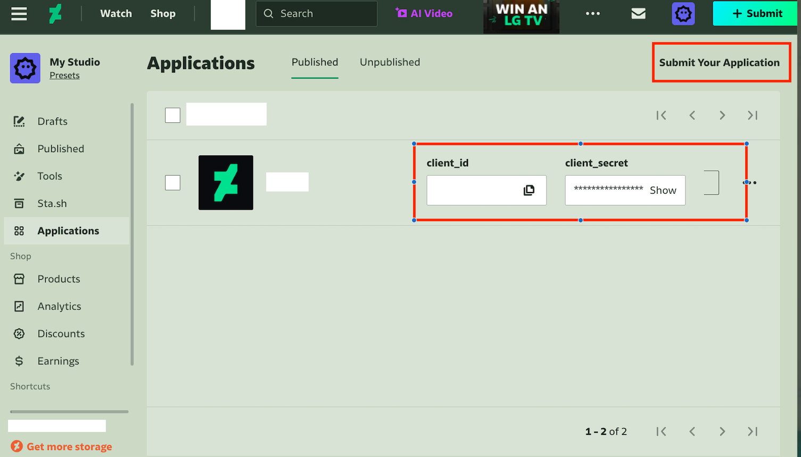
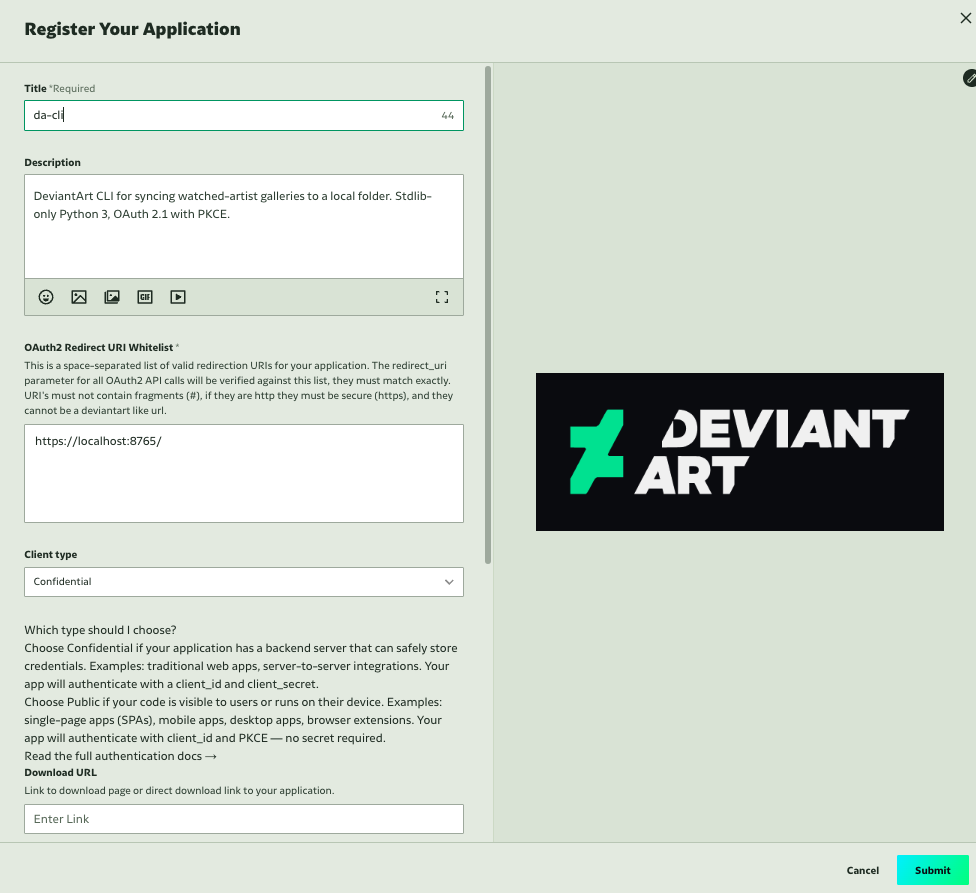

# Complete Setup Guide

**Never used a command line before? This guide is for you.**
Everything is explained step by step. By the end you'll have da-cli
downloading art automatically every day.

Total time: **about 10 minutes**.

---

## What you'll need

- A computer running macOS, Linux, or WSL (Windows Subsystem for Linux)
- A DeviantArt account
- About 10 minutes

---

## Step 1: Check if Python is installed

da-cli runs on Python. Most computers already have it.

Open your **Terminal** (macOS: press `Cmd + Space`, type "Terminal",
press Enter) and type:

```bash
python3 --version
```

**If you see something like `Python 3.10.x` or higher:** Python is
ready. Skip to Step 2.

**If you see "command not found" or the version is below 3.10:**

- **macOS:** Install [Homebrew](https://brew.sh) (follow the
  instructions on their homepage), then run:

  ```bash
  brew install python
  ```

- **Linux (Ubuntu/Debian):**

  ```bash
  sudo apt update && sudo apt install python3 python3-pip
  ```

Check again with `python3 --version` to confirm it's 3.10 or higher.

---

## Step 2: Download and install da-cli

In your Terminal, run these three commands one at a time:

```bash
git clone https://github.com/FZ2000/da-cli.git ~/da-cli
```

```bash
cd ~/da-cli
```

```bash
./install.sh
```

You should see output like:

```text
installed:
  ~/.local/share/da-cli/da
  ~/.local/share/da-cli/dacli/
  ~/.local/bin/da -> ~/.local/share/da-cli/da

da-cli 0.3.0
```

**If you see `da-cli 0.3.0`** — installation worked. Move to Step 3.

**If you see "da: command not found"** — your system doesn't know
where to find `da`. Fix it by adding the install directory to your
PATH:

```bash
echo 'export PATH="$HOME/.local/bin:$PATH"' >> ~/.zshrc
source ~/.zshrc
```

(Use `~/.bashrc` instead of `~/.zshrc` if you're on Linux.)

Try `da --version` again. It should work now.

---

## Step 3: Create a DeviantArt OAuth Application

da-cli needs your permission to access your DeviantArt account. You
grant this by creating an "OAuth Application" on DeviantArt. This is
a one-time step — you never have to do it again.

### 3a. Open the DeviantArt developer portal

Go to this URL in your web browser:

**<https://www.deviantart.com/developers/>**



This page lists any existing DA applications you've created. To create
a new one, click **"Register Your Application"** (or **"Submit Your
Application"**).

### 3b. Fill in the registration form

You'll see a form with several fields. Fill it in exactly like this:



> **Example:** the screenshot above shows a completed
> registration form. Match every field exactly — especially the
> **Redirect URI** and **Client type**.

Here's what each field means:

| Field | What to type | Why |
|---|---|---|
| **Title** | `da-cli` | Any name you like; this is just a label. |
| **Description** | *(leave blank)* | Optional; not used by da-cli. |
| **OAuth2 Redirect URI Whitelist** | `https://localhost:8765/` | This is the address da-cli listens on for the login callback. **Must match exactly** — including the trailing slash. |
| **Client type** | **Confidential** | Issues a `client_secret`, which da-cli stores in the macOS Keychain and sends on the token exchange. It is **optional** — every code path guards on it, and without one da-cli authenticates as a public client using PKCE, which is what DeviantArt's own form recommends for desktop apps. Choose Confidential if you want the secret; Public works too. |
| **Download URL** | *(leave blank)* | Not used by da-cli. |
| **Original URLs Whitelist** | *(leave blank)* | Not used by da-cli. |

> **The Redirect URI is the #1 source of setup failures.** It must
> be `https://localhost:8765/` — with the `https://`, the port
> `8765`, AND the trailing `/`. If any character is wrong, the login
> step (Step 5) will fail. See the [troubleshooting table](guides/troubleshooting.md)
> for common mistakes.

Click **Save** (or **Register** / **Submit**).

### 3c. Get your Client ID and Client Secret

After saving, DeviantArt redirects you to your application's page.
You can always return here at:

**<https://www.deviantart.com/studio/apps>**

On this page, find these two values:

- **Client ID** — a short number (e.g. `12345`)
- **Client Secret** — a long string of letters and numbers

**Copy both values.** You'll paste them into da-cli in the next step.

> **If you lose the Client Secret:** Go back to
> <https://www.deviantart.com/studio/apps> → click your app → click
> **"Reset Secret"**. DA generates a new one. The old one stops
> working immediately.

---

## Step 4: Tell da-cli your credentials

Go back to your Terminal. Run these three commands, **replacing the
example values with the ones DeviantArt gave you**:

```bash
da config set client_id 12345
```

*(Replace `12345` with your actual Client ID.)*

```bash
da config set client_secret YOUR_CLIENT_SECRET_HERE
```

Replace the long string with your actual Client Secret.

```bash
da config set destination ~/Pictures/DA
```

*(This tells da-cli where to save downloaded art. You can use any
folder path — `~/Downloads/DA`, `/Volumes/External/art`, etc.)*

**What just happened?**

| What | Where it's stored | Security |
|---|---|---|
| Client ID | `~/.config/da-cli/config.json` | It's a public identifier, not a secret. |
| Client Secret | **macOS Keychain** (service `da-cli`) | Encrypted, tied to your user account. Never written to a plain file on macOS. |
| Destination | `~/.config/da-cli/config.json` | Just a path preference. |

Verify everything is stored correctly:

```bash
da config show
```

You should see:

```json
{
  "client_id": "12345",
  "client_secret": "a1b2...c3d4",
  "destination": "~/Pictures/DA"
}

config file: ~/.config/da-cli/config.json
state file:  ~/.local/state/da-cli/state.json
keychain:    service="da-cli" (used for ['client_secret'])
```

The `client_secret` shows as `a1b2...c3d4` (masked) — that's normal.
da-cli never displays the full secret after storing it.

---

## Step 5: Log in to DeviantArt

```bash
da auth
```

This command opens your web browser and takes you to DeviantArt.

### What happens in the browser

1. **DeviantArt asks you to log in** (if you aren't already).
   Log in with your DA username and password.

2. **DeviantArt shows an authorization page.**

   This page says da-cli is requesting access to your account.
   Click **"Authorize"**.

3. **Your browser may show a security warning** —
   "Your connection is not private" or "This site is not secure."

   **This is expected and safe.** Here's why:

   da-cli starts a tiny web server on your computer (port 8765) to
   receive the login confirmation from DeviantArt. DA's developer
   portal requires this server to use HTTPS, so da-cli creates a
   self-signed certificate. Your browser doesn't trust it (because
   you made it yourself, not a certificate authority), so it warns
   you.

   **How to proceed:**

   | Browser | What to click |
   |---|---|
   | **Chrome** | "Advanced" → "Proceed to localhost (unsafe)" |
   | **Firefox** | "Advanced" → "Accept the Risk and Continue" |
   | **Safari** | "Show Details" → "visit this website" → "Visit Website" |

   The certificate is only used on your machine, only for this
   login step. It never touches any network traffic.

4. **After clicking Authorize**, your browser shows:
   "Authorized. You can close this tab."

### What you'll see in the Terminal

```text
authenticated. scope=browse. tokens stored in ~/.local/state/da-cli/state.json.
```

**You're logged in.** This lasts 90 days — you won't need to
re-authenticate until then. da-cli will warn you 14 days before the
token expires (run `da diagnose` or `da auth status` to check).

---

## Step 6: Verify everything works

```bash
da whoami
```

Expected output:

```text
token: valid (placebo OK)
scope: browse
access_token expires in: 3598s
@YourDeviantArtUsername  userid=ABCDEF12-...
```

If you see your DeviantArt username — **everything is working.**

---

## Step 7: Download your first deviations

```bash
da sync feed
```

This pulls new art from the artists you watch on DeviantArt. The first
run downloads everything currently in your feed.

Output looks like:

```text
[0s] feed offset=0
  + ArtistName/Sample Title            245 KB
  + AnotherArtist/Cool Art             1.2 MB
feed sync stopped: feed exhausted; ok=2 dup=0 noimg=0 fail=0
```

Check what was downloaded:

```bash
ls ~/Pictures/DA/
```

Each artist gets their own folder. Each deviation has a subfolder with
two files:

```text
~/Pictures/DA/
└── ArtistName/
    └── Sample Title/
        ├── description.json   ← title, tags, stats, full description
        └── image.jpg          ← the actual image at highest resolution
```

Run `da sync feed` again tomorrow — it only downloads **new** art
(skips what it already has). This is powered by a SQLite index that
makes re-runs nearly instant.

---

## Step 8: Try more commands

```bash
da search tag nature --limit 5       # browse art by tag
da daily                             # today's Daily Deviation picks
da user profile deviantart           # look up an artist's profile
da search user deviantart            # find a DA username
da search topics --limit 10          # list curated DA topics
da diagnose                          # health check (config, auth, disk space)
```

---

## Optional: Daily automatic downloads (macOS)

Want art downloaded automatically every day at 3 AM?

```bash
./install_schedule.sh
```

Then grant Full Disk Access (required for writing to protected folders):

1. **System Settings** → **Privacy & Security** → **Full Disk Access**
2. Click **+**
3. Drag in `~/Applications/da-sync.app`

Customize the schedule:

```bash
DA_HOUR=21 DA_MINUTE=30 ./install_schedule.sh    # 9:30 PM daily
DA_INTERVAL_SECONDS=21600 ./install_schedule.sh   # every 6 hours
```

Remove: `./install_schedule.sh uninstall`

---

## Something went wrong

See [troubleshooting](guides/troubleshooting.md) — it is organised by
the exact message you got. The quickest first step is:

```bash
da diagnose
```

## Need more help?

- [Full command reference](../README.md#quick-tour)
- [All configuration options](reference/configuration.md)
- [Example scripts](../examples/)
- [Open an issue](https://github.com/FZ2000/da-cli/issues)
